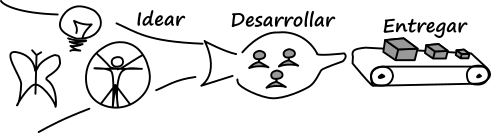

# F\*\*\* the Manifesto

Por Juan Gabardini, @jgabardini

Etiquetas: lean, agile manifesto, cynefin, artful making

Han pasado 20 años desde la definición de Scrum y 15 desde la creación del Manifiesto Ágil (*Agile Manifesto*). Es tiempo de dejar atrás algunas soluciones a problemas que ya no existen y repensar, desde el contexto actual, qué queremos lograr, y cómo. Este texto es una ampliación a la [presentación que di en Ágiles 2015](http://www.slideshare.net/jgabardini/f-the-manifesto-54574475)

## De dónde venimos: Agile y su contexto

En los '70 y '80 el software creció en complejidad y tamaño, por sobre el hardware, hasta convertirse en el principal componente de costo en el desarrollo de sistemas. La causa principal fue que los procesos para crear software no evolucionaron de manera acorde a la creciente complejidad.

A inicios de los '90, el desarrollo de software se había transformado en el cuello de botella. Este problema, la *Crisis del Software*, se muestra en el CHAOS Report (1994). Se intentó mejorar la creación de software usando ideas de vinculadas con procesos de manufactura como control estadístico y mejora de procesos (CMM en 1993), automatización y robotización (CASE, RUP en 1996 y la generación automática de código).

En ese contexto surgieron varias alternativas que buscaron resolver la *Crisis del Software* desde otro paradigma: Scrum (1995), Crystal (1992-1997), Extreme Programming (1996) y otras. Estas formas alternativas tuvieron éxito entre los *Innovadores* y *Primeros seguidores*. 

Figura 1 - Curva de adopción de innovaciones

Curva de adopción de innovaciones[^1]:

* Innovadores: Valoran lo nuevo.

* Primeros seguidores: Valoran la utilidad y aceptan inconvenientes y detalles no pulidos.

* Mayoría temprana: Valoran la utilidad, esperan que sea fácil de adoptar y detalles pulidos.

* Mayoría Tardía: Valoran la estabilidad. Asumen que si muchos adoptaron, debe ser bueno. No quieren quedar atrás.

* Rezagados: Evitan los riesgos. Postergan todo lo posible la adopción.

## El Manifiesto Ágil

En 2001, 17 personas representantes de formas alternativas de desarrollo de software deciden unir dichas metodologías bajo el paraguas de *Desarrollo Ágil de Software* como una manera para llegar a la mayoría de los desarrolladores de software. Además del nombre común que sirve de marca, publicaron un Manifiesto que consiste en 4 valores y 12 principios, que permite limitar quiénes pueden usar la marca.

Una forma de entender la estrategia que utilizaron es tomando la curva de adopción de innovaciones (ver arriba); el Manifiesto Ágil permitió cruzar la brecha entre los *Primeros seguidores* y la *Mayoría temprana*. Podemos decir que fueron exitosos. El *Desarrollo Ágil de Software* es hoy referencia obligada, aunque no todos los desarrollos la utilicen.

Pero el éxito tuvo también costos [^2]. Para pasar de los *Innovadores* y *Primeros seguidores* a la *Mayoría temprana* se debe cambiar el foco de la innovación [Moore 2014]. Se busca mejorar la usabilidad [Fontdevila 2014]. Debe ser fácil de implementar, de mantener. Buscamos tener lenguajes comunes, simplificar. Porque el limitante es llegar a personas y organizaciones menos propensas a soportar los inconvenientes (*glitches)* de las nuevas tecnologías.

Durante la etapa de *Mayoría temprana* la escalabilidad de la innovación es el principal limitante. ¿Cuán rápido podemos brindar el producto/servicio? En este caso, ¿cuán rápido pueden adoptar agilidad las personas, los equipos, las organizaciones? En esta instancia buscamos tener soluciones estandarizadas, FAQ, soporte de expertos [Moore 2004].

El costo de esta simplificación y estandarización es que, como comunidad de práctica, nos hemos vuelto dogmáticos y menos innovadores. Veo esto más notorio con los Valores del Manifiesto. Algunas personas de la comunidad utilizan los valores como si estos fueran inamovibles y absolutos. "Si hacemos un proceso automático para (...) Hey, valoramos Individuos e interacciones sobre procesos y herramientas".

Una forma de sacarnos el dogmatismo es aceptar que todas nuestras creencias pueden ser criticadas con el objeto de entenderlas y, quizás, encontrar limitaciones o alternativas. Analizaré a continuación los valores, con esa mirada crítica [^3].

Nota: Siempre podemos resignificar el Manifiesto cambiando la definición de las palabras, para acomodarlo a que signifique lo que queremos que signifique: "cuando decimos software funcionando queremos decir valor de negocio", "cuando decimos contrato queremos decir acuerdo", … Cada uno es libre de autoengañarse y nos deslizamos hacia una secta, como se comenta en el capítulo "¿El agilismo es una secta?".

### Lenguaje usado en los valores

En este análisis usaré los niveles del lenguaje según lo descrito en *Tribal Leaderhip* [^4]:

1. Derrotado: (todo en) La vida es una porquería.

2. Víctima Apática: Mi vida es una porquería … y la tuya quizás no.

3. Guerrero solitario: ¡Soy genial! … y vos no.

4. Orgullo tribal: ¡Somos geniales! … mucho mejor que ustedes.

5. Asombro inocente: ¡La vida es genial!

Cada persona pueden entender el nivel de lenguje que utiliza su tribu y uno más o menos. Por ejemplo, alguien que se expresa en nivel 2, puede entender el nivel 1 y 3, pero no el nivel 4 y 5. Para llegar a la mayor cantidad de personas, como se buscaba con el Agile Manifiesto, es común y deseable que se hable con lenguaje correspondiente a varios niveles de *Tribal Leadership*. 

Tanto el nombre elegido ("Manifiesto Ágil") como el texto que habla de su historia  ([http://agilemanifesto.org/history.html](http://agilemanifesto.org/history.html)) utiliza lenguaje **Nivel 5**, *“queremos cambiar el mundo”*.

El foco en valores (es lo primero que se lee), podría entenderse como lenguaje **Nivel 4**. Las tribus nivel 4 se identifican por sus valores compartidos. También aparece el contraste con el enemigo externo, se sienten superior a otros, que en este caso son las *Dilbertesque corporations*. Pero para los que leen el Manifiesto, los valores no necesariamente son los de su equipo o grupo, son los valores de otro grupo. Trabajar bajo valores impuestos desde fuera nos lleva a lenguaje **Nivel 3** (los que imponen sus valores) y **Nivel 2** (los que reciben los valores impuestos).

Como comentó Brian Marick en el keynote de Ágiles 2009, para algunos, la llegada de la agilidad a sus organizaciones sólo significó que su trabajo sea menos horrible (*My work sucks less*), cuando los firmantes esperaban transformar el ámbito de trabajo para hacerlo disfrutable. Veo esto en comentarios de la comunidad contra el opresor de turno (PMI, CMMi, los jefes, las corporaciones, las picadoras de carne, <completar con tu monstruo opresor>) que nos obligan a hacer las cosas mal y nos hacen sufrir en el trabajo. Esto es lenguaje **Nivel 2**.

En el Manifiesto Ágil se presentan los valores como una comparación "Valoramos […] por sobre […]". Los firmantes iniciales del Manifiesto lo escribieron desde los valores compartidos (lenguaje **Nivel 4**), pero muchos han usado esos valores como comparación individual, "mis valores son mejores que los tuyos", que es lenguaje **Nivel 3**. Además, esa forma se volvió obsoleta en cuanto la agilidad se volvió *mainstream*. Cada vez más personas, equipos y organizaciones llegan a la agilidad sin haber pasado ni por PMI, ni por CMMi ni por RUP.

### Individuos e interacciones sobre procesos y herramientas

Figura 2 - El proceso de desarrollo

Aquí usaré dos conceptos [^5]:

* *Arful making*: los trabajos de creación e innovación que tienen bajo costo para iterar. Implica exploración de alternativas y cambio constante. Ejemplos: preparación de una obra de teatro, desarrollo de software, creación de un plan de negocios.

* *Industrial making*: construcción de un auto, armado de los escenarios de una obra de teatro (no el diseño del mismo).

Las personas que participaron en la escritura del Manifiesto le hablaron a personas en equipos de desarrollo de software, que estaban siendo obligados a trabajar de formas apropiadas a una situación de *Industrial making*, cuando ellos se veían más cercanos a una situación apropiada a *Artful making*. Aceptaban la necesidad de procesos y herramientas, dado que siempre hay al menos un poco de ambos. Pero algunos de los que adhieren al Manifiesto (no los firmantes originales) llevaron esto a extremos dogmáticos.

Veamos algunas búsquedas de balance:

* Brian Marick (Ágiles 2009 y otros eventos, [arxta.net/](http://arxta.net/)): Habló del Retro-futurism (entre otras cosas), para rescatar las herramientas como parte imprescindible de la agilidad.

* Continuous Delivery (libro 2010, [continuousdelivery.com](https://continuousdelivery.com/)): El proceso y la mejora de procesos son importantes. El tiempo desde que confirmamos el cambio en el código (*commit stage*) hasta que el usuario utilice el producto es desperdicio (*waste*) y debe ser eliminado por medio de mejora continua. Corresponde a la parte de la derecha de la Figura 2.

* Lean Startup (libro 2011, [theleanstartup.com](http://theleanstartup.com/)): Aún la parte más creativa (la izquierda de la Figura 2) puede ser mejorada con procesos y métricas.

* Tuckman (1963): Los equipos, antes de ser de alto rendimiento (*Performing*), pasan por la etapa de acuerdos en sus procesos (*Norming*).

Un punto central, a veces perdido de vista, en este balance entre individuos y procesos, es la diferencia entre:

* Un proceso propuesto (o impuesto) desde fuera, como un objetivo a cumplir definido por "los que saben", que no son del equipo.

* Un proceso definido por el equipo tomado la forma en que hacemos el trabajo actualmente, como base para los experimentos de mejora del mismo equipo para avanzar hacia un objetivo desafiante, con tiempos definidos por el equipo (si querés profundizar, buscá Toyota Kata).

### Software funcionando sobre documentación extensiva

Este valor parece especialmente apuntado a contrastar con CMMi / PMI / RUP. Esta comparación es anacrónica y ha perdido relevancia. Tanto CMMi, PMI y RUP se han ocupado en acercarse a Agile todo lo posible.

Pero analicemos cada parte con más profundidad:

* "Software funcionando": ¿Es nuestro principal objetivo? ¿Cuál es el valor de lo que hacemos? Nos podemos preguntar si el software está siendo usado, cuál es el nivel de satisfacción del cliente en relación a  la experiencia completa, o cuál es el impacto de negocio logrado [^6]. 
Ejemplo: En el primer equipo del que participé desarrollando ágilmente, pasamos de estar desarrollando un año sin un producto entregado, a desarrollar en 6 semanas y luego cada 15 días, un incremento de producto. Pero el resultado neto para la empresa fue el mismo, no se vendió ni una licencia del producto.

* "Documentación extensiva": ¿Es un problema la documentación extensiva? Prefiero cambiar la pregunta por: ¿Cuál es el valor de la documentación y cuáles son los problemas relacionados con la documentación? La documentación puede ser usada para comunicación dentro del equipo, comunicación con el equipo futuro (para operar, mantener y evolucionar) o para terceros (clientes, entes reguladores). Los problemas de la documentación son el costo de generar, usar y mantener actualizada. Para cada uno de los usos habituales, podemos encontrar soluciones alternativas que no tengan los problemas planteados. 
En relación al costo de mantenimiento, buscamos lograr que el cambio en el software implique un cambio acotado en la documentación. Es una condición necesaria para el desarrollo iterativo e incremental (costo de reconfiguración en Artful making) que el costo esté relacionado con el tamaño cambio y no con el tamaño total del producto. Ejemplos de esto es tener documentación ejecutable (potencialmente escrita antes que el software), corriendo en ambientes de Integración continua. Esto permite que la documentación desactualizada se detecte rápidamente (esta y otras ventajas en [Adzik 2011]).
Otro ejemplo es disminuir o eliminar los documentos de instalación. Se pueden reemplazar por automatización, tanto para la creación de los ambientes (*provisioning*), instalación y configuración. 

### Colaboración con el cliente sobre negociación contractual

Este valor asume que tenemos un cliente con quien colaborar o resolver nuestras diferencias consultando el contrato. Nuevamente, está pensado desde el punto de vista de un equipo de desarrollo de software, mientras que el cliente es alguien externo (o que se comporta como un externo) que paga por el trabajo del equipo.

Hay varias cosas que no me gustan de este valor:

* Que resalte sólo la colaboración con el cliente. Esperaría que la colaboración se dé internamente en el equipo y con cualquier otra persona o grupo con los que interactúa el equipo.

* No siempre tenemos a un cliente conocido. El proceso completo de creación de software incluye la ideación y descubrimiento del producto que cubrirá las necesidades de un segmento (Lean Startup, Design Thinking). Cuando aún estamos descubriendo quiénes serán nuestros clientes ¿que significaría colaborar con ellos?

* No siempre tenemos un contrato con el cliente/usuario. En proyectos open source tenemos donaciones, en startups y en la organización de un evento, tenemos un equipo que tiene acuerdo internos, pero el que paga llega cuando mucho del trabajo ya está hecho. En estos contextos, este valor se vuelve irrelevante.

### Respuesta ante el cambio sobre seguir un plan

Diferentes situaciones requieren ser tratadas de diferente manera, el marco Cynefin nos ayuda en eso proponiendo estos espacios:

* *Obvio*: Los resultados de cada acción son conocidos, un manual o secuencia de pasos pre-establecido nos conducen siempre a la solución.

* *Complicado*: Puede haber varias maneras de llegar al resultado esperado, pero dependen de las condiciones iniciales. Un experto puede analizar la situación y recomendar un plan de acción.

* *Complejo*: Las acciones tienen retroalimentacion y relaciones complejas. Llegamos a la solución tomando acciones que nos acerquen a la solución, validando continuamente el avance y ajustado (Inspeccionar y Adaptar).

* *Chaos*: Es impredecible el resultado de las acciones. Solo nos queda reaccionar corrigiendo. En algunos casos, problemas que parecían Obvios pueden convertirse en caóticos.

En este valor se asume que estamos en el espacio de lo Complejo y por lo tanto lo resolvemos Inspeccionando y Adaptando. El supuesto puede no cumplirse. Por ejemplo, en la forma de proceso que indicamos en la Figura 2, esperaría que el proceso de despliegue (la cinta transportadora de la derecha) sea predecible y se comporte según el plan; que la forma de desplegar sea Obvia. Y ese mismo proceso, puede convertirse en Caótico, como se presenta en el libro Antifragilidad y herramientas como *Chaos Monkey*. 

Por otro lado, ¿qué es un plan? 

Ejemplo Scrum: Si digo que planifico mi iteración (sprint) en Planificación, Reuniones diarias, Revisión y Retrospectiva, ¿qué pasa cuando, por algún problema, no tenemos un incremento de funcionalidad? ¿Respondemos ante el cambio postergando o suspendiendo la Revisión? ¿Alargamos el sprint?

Ejemplo Open Space Technology [^7]: Es una forma de organizar conferencias en las que la agenda de actividades se define al inicio del evento. La estructura del evento está definida,  tiene una apertura, luego se proponen las sesiones, se realizan las sesiones y por último se hace el cierre. No tiene definido los oradores/ facilitadores de cada sesión, ni los temas de cada sesión. Se recuerda siempre que los asistentes son responsables de gestionar su tiempo y elegir lo que creen que aporta más valor. Si cumplimos con el horario de cierre, a pesar que alguna de las últimas sesiones no finalizó, ¿Estamos siguiendo un plan y no respondiendo al cambio?

Este valor está llamando la atención sobre una forma rígida de definir los planes al inicio y seguirlos sin cambios. 

Pero eso es una mala aplicación de la idea del plan. También podríamos decir que "Preferimos preparar planes tal que incorporar cambios no sean catastrófico".

### Lo que no está en los valores

Además de lo ya comentado, algunas practicantes encontraron que en los valores no se hace referencia a la calidad de lo construido. 

Se disparó entonces el movimiento de Artesanos del software (*Craftsmanship*). Si se agregara a los valores, el artesano orgulloso de su trabajo suele expresarse con lenguaje **Nivel 3**. 

No hay en los valores referencia a la mejora continua de los equipos. Si se agregara, el orgullo del equipo y los equipos de alto rendimiento suelen expresarse en lenguaje **Nivel 4**. 

En ambos casos, hay principios relacionados a la calidad técnica y la mejora continua en los principios del Manifiesto Ágil, pero no en los valores.

## ¿Y si lo mejoramos?

El Manifiesto Ágil fue sumamente exitoso y equipo que gana no se toca [^8]. Por ello, pasaron muchos años antes que se sintiera la necesidad, como comunidad, de replantear los acuerdos que surgieron en la reunión original. Y es difícil lograr nuevos acuerdos que sumen una masa crítica de voluntades, quizás por eso tardaron tanto en surgir nuevas propuestas. Comento a continuación, sólo como disparadores de la discusión, algunas de las ideas que conozco al respecto. Hay puntos en común, algunos evidentes (como Experimentation y Experimenta y aprende rápido) [^9] y otros más sutiles, como el foco en la forma de aprendizaje presente en la propuesta de Kokoro y la propuesta de ir a Modern Agile sin pasar por las formas históricas.

### Navigating Complexity

Propuesto por Tobias Mayer [^10] y Alan Cyment, alrededor de la metáfora entre los sistemas Orgánicos y Mecánicos, plantea los siguientes valores:

* *Dreaming*

* *Fractality*

* *Oscillation*

* *Experimentation*

### Heart of Agile y Kokoro

Propuesto por Alistair Cockburn, plantea que cada persona que pasó por los estados de Shu -  Ha - Ri, al llegar a Ri tiene contacto con la esencia, el centro, de la disciplina (kokoro) [^11]. Cuanto trata de explicarla, transmitirla, a los que inician el camino (Shu) necesariamente la simplifica. Cada maestro de la disciplina puede llegar a una simplificación distinta.

En Heart of Agile [^12] o kokoro de Agile, según Alistair, él busca que el principiante pueda tener una guía clara de qué hacer y por ello propone acciones:

* *Collaborate*

* *Deliver*

* *Reflect*

* *Improve*

### Modern Agile

Joshua Kerievsky participó de una serie de talleres realizados en eventos comunitarios. A partir del brainstorming original se fueron agrupando las ideas hasta llegar a cuatro. En el Agile 2017 presentó un keynote en la que comentó que, más allá del valor que tuvo el Manifiesto Ágil y las metodologías de esa época, es tiempo de ir más allá. Y que no hay justificativos para pasar por las técnicas que eran útiles hace 20 años, podemos ir directamente a las actuales[^13]. Plantea los siguientes principios guía:

* Haz que las personas sean geniales

* Entrega valor continuamente

* Haz de la seguridad un prerrequisito

* Experimenta y aprende rápido

## Conclusión

Estamos entrando en una zona de turbulencias, como comunidad, donde la referencia de quiénes somos o qué hacemos no es tan clara. Sin embargo, creo que cada una de las propuestas tiene valor y podemos, cada uno, empezar probando con cualquiera de ellas, ver si nos sentimos cómodos y si es útil. Sobre esa experiencia, quizás decante en un nuevo consenso. ¡Y si no, al menos no desperdiciamos tiempo discutiendo cual es "la correcta"!

[^1]: Ver [http://softwareagil.blogspot.com.ar/2015/11/difusion-de-las-innovaciones.html](http://softwareagil.blogspot.com.ar/2015/11/difusion-de-las-innovaciones.html).

[^2]: Ver "Fragilidad" de Nicolás Páez, en este libro.

[^3]: Ver [http://alistair.cockburn.us/oath+of+non-allegiance](http://alistair.cockburn.us/oath+of+non-allegiance).

[^4]: Ver el video [https://www.ted.com/talks/david_logan_on_tribal_leadership](https://www.ted.com/talks/david_logan_on_tribal_leadership) y el libro Tribal Leaderhip de Dave Logan y John King.

[^5]: Una descripción un poco más extensa está en [http://softwareagil.blogspot.com.ar/2009/07/artful-making.html](http://softwareagil.blogspot.com.ar/2009/07/artful-making.html) y el libro Arful making, Lee Devin y Robert D. Austin.

[^6]: Corresponde al Derecho Slow #2 del capítulo "Nuestros Derechos Slow" de Thomas Wallet.

[^7]: Más información sobre el open space, de Maica Trinidad: [http://reeelab.com/2013/02/16/manual-de-instrucciones-para-un-open-space/](http://reeelab.com/2013/02/16/manual-de-instrucciones-para-un-open-space/).

[^8]: Los firmantes originales acordaron no modificar el documento inicial: [http://alistair.cockburn.us/What+are+you+reaching+for%3f+or%2c+why+the+agile+manifesto+won't+get+rewritten](http://alistair.cockburn.us/What+are+you+reaching+for%3f+or%2c+why+the+agile+manifesto+won't+get+rewritten).

[^9]: También presente en "Cuando el Arte ataque" de Martín Salias, en este libro.

[^10]: Ver [https://www.slideshare.net/PhiliyLander/navigating-complexity-london-2016](https://www.slideshare.net/PhiliyLander/navigating-complexity-london-2016)

[^11]: Sobre la idea del maestro que enseña: [http://alistair.cockburn.us/Shu,+Play,+Kokoro+are+3+doorways+into+a+skill](http://alistair.cockburn.us/Shu,+Play,+Kokoro+are+3+doorways+into+a+skill)

[^12]: Heart of Agile: [http://alistair.cockburn.us/HeartOfAgile](http://alistair.cockburn.us/HeartOfAgile) / pdf: [http://alistair.cockburn.us/get/3613](http://alistair.cockburn.us/get/3613)

[^13]: Material, descripción, presentaciones, videos, traducciones: [http://modernagile.org/](http://modernagile.org/).
